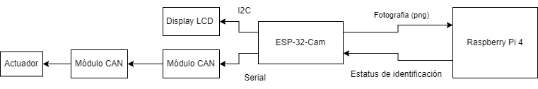

# TE2004B
Sistema contra robo de  vehículos

## Objetivo
Desarrollar un sistema con dos cámaras de video, las cuales monitorearán el  interior del vehículo,
en específico a la persona
que está conduciendo. 
El sistema iniciará cuando el usuario entre al
vehículo, las cámaras integradas al sistema capturarán la imagen del conductor cada 30
segundos y un sistema comparará la imagen con los registros de 5 personas que están autorizadas
para manejar el coche y cuyos números de celular se encuentran registrados. 

En caso que la
persona al volante no esté registrada en el sistema, este deberá de enviar una alerta a los
celulares de las personas autorizadas. En el mensaje se deberá de incluir la ubicación del
vehículo así como la foto de quien está conduciendo el coche. El sistema deberá de tener una
opción de Valet parking para desactivar el sistema cuando se deja en un estacionamiento.

